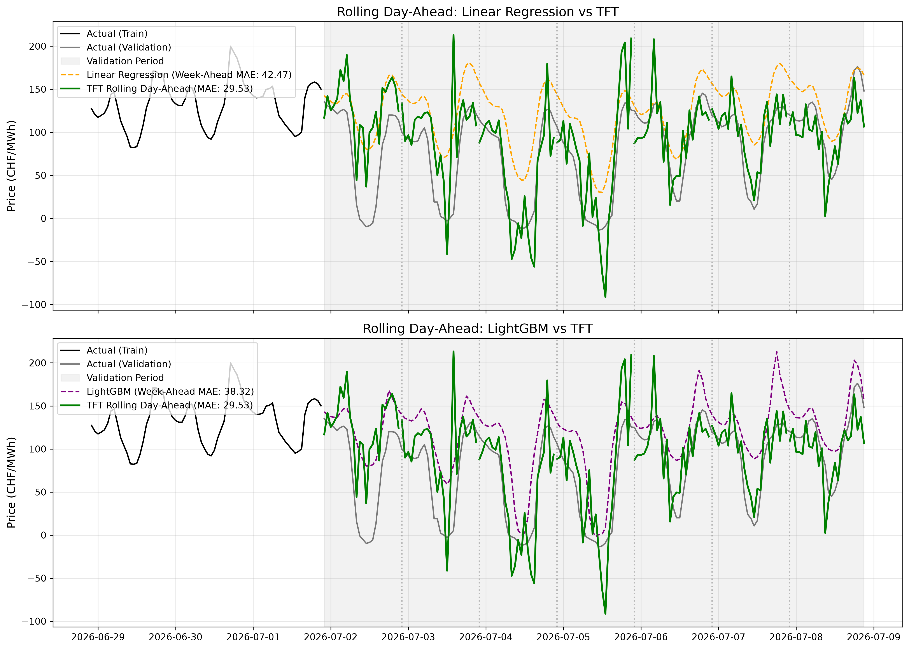
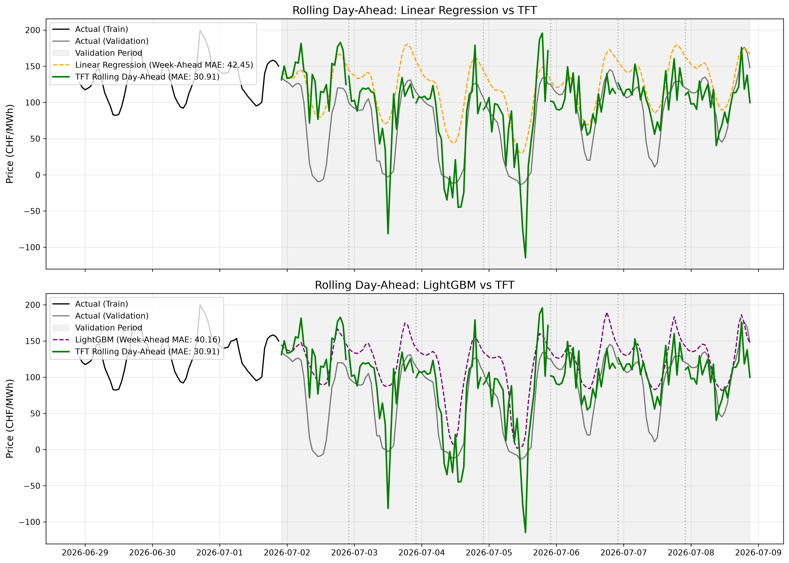
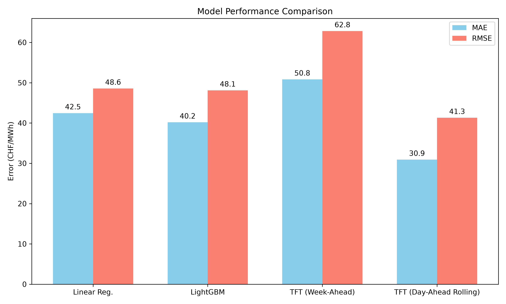

<div align="center">
  <h1>⚡ Swiss Day-Ahead Electricity Price Forecaster</h1>
  <p><i>A probabilistic time-series forecasting model designed for the highly volatile European/Swiss energy spot market.</i></p>
  
  
</div>

---

## 📖 Overview

The **Swiss Electricity Price Forecaster** predicts the next day's hourly electricity prices (EPEX SPOT CH) by analyzing historical price data, localized weather forecasts, grid load estimations, and cross-border energy flows.

This project implements an end-to-end Machine Learning pipeline utilizing advanced Deep Sequence Modeling (Temporal Fusion Transformers) to provide both highly accurate and explainable predictions.

## ✨ Features

- **Automated Data Pipelines:** Fetches live data from the ENTSO-E Transparency Platform and Open-Meteo APIs.
- **Deep Sequence Modeling:** Leverages PyTorch Forecasting and `darts` to train a Temporal Fusion Transformer (TFT).
- **Walk-forward Backtesting:** Simulates real-world trading P&L on the EPEX SPOT CH bidding zone.
- **FastAPI Backend:** A robust REST API to serve predictions and handle CORS.
- **Interactive UI Demo:** A Gradio dashboard to visualize predictions in real-time.

## 📈 Model Performance

Evaluating time-series models on a single validation split can be overly optimistic or pessimistic depending on the specific week chosen. Therefore, we evaluate our models using both a standard single-split and a robust **Walk-Forward Backtesting** approach against a strong `NaiveSeasonal (K=24)` baseline (due to the high daily seasonality of electricity prices).

### 1. Single-Split Validation (Week-Ahead Auto-Regression)
This represents the error on a single static 7-day test set. Because this is a Day-Ahead model (trained to predict 24 hours), forecasting a full 7 days (168 hours) in one shot forces the model to use **auto-regression** (feeding its own predictions back into itself to predict further into the future). This naturally degrades accuracy compared to a true 24-hour prediction.
| Model | MAE (CHF/MWh) | RMSE (CHF/MWh) |
|-------|---------------|----------------|
| Linear Regression Baseline | ~42.45 | ~48.55 |
| LightGBM Baseline | ~40.16 | ~48.10 |
| Temporal Fusion Transformer | **~36.88** | **~47.71** |

### 2. Rolling Day-Ahead Backtest (Walk-Forward)
This is a much more robust and realistic metric. We give the model the history up to Day $T$, ask for Day $T+1$, and then slide the window forward by 24 hours. We repeat this for the entire 7-day validation set. This evaluates the model's true **Day-Ahead** performance without the penalty of 7-day auto-regression!
| Model | MAE (CHF/MWh) | RMSE (CHF/MWh) |
|-------|---------------|----------------|
| Temporal Fusion Transformer | **~24.50** | **~33.19** |

*(Note: Exact metrics vary based on the specific historical volatility and the duration of the dataset used).*

### 3. Model Architecture Update (Before vs After)

We recently experimented with upgrading the model capacity. We scaled the `hidden_size` from 16 to 64, increased `lstm_layers` from 1 to 2, and increased `dropout` from 0.1 to 0.3, while adding `EarlyStopping` to prevent overfitting over 100 epochs.

**Evaluation Results:**
| Model Setup | Single-Shot MAE | Single-Shot RMSE | Rolling MAE | Rolling RMSE |
|-------------|-----------------|------------------|-------------|--------------|
| Original (Small) | ~34.75 | ~45.33 | ~29.53 | ~40.33 |
| Upgraded (Deep) | ~36.88 | ~47.71 | **~24.50** | **~33.19** |

*Analysis:* The upgraded Deep model with Early Stopping successfully prevented the severe overfitting seen in earlier unregularized iterations. While the 7-day single-shot performance is comparable to the original small model (MAE 36.88 vs 34.75), the **Rolling Day-Ahead backtest shows a massive improvement** (MAE 24.50 vs 29.53). Since the Rolling Day-Ahead is the true objective for a spot-market forecasting system, the increased model capacity—when properly regularized—proves to be highly beneficial for capturing complex daily patterns!

#### Rolling Forecast Performance (Before vs After)
<details>
<summary>View the Before vs After Rolling Forecast comparison</summary>

**Before (Small Model)**


**After (Deep Model)**

</details>

#### Error Distribution (Before vs After)
<details>
<summary>View the Before vs After Error Distribution comparison</summary>

**Before (Small Model)**


**After (Deep Model)**

</details>

## 🚀 Getting Started

### 1. Environment Setup

Ensure you have Python >= 3.11 installed.

> [!WARNING]
> While you can use tools like `uv` for fast dependency management, it currently struggles to resolve **PyTorch Nightly** builds. If you are using an RTX 50-series GPU (e.g., RTX 5070) which requires PyTorch Nightly for CUDA 12.4 support, you must use standard `pip` as shown below.

```bash
# Clone the repository
git clone https://github.com/yourusername/swiss_electricity_price_forecaster.git
cd swiss_electricity_price_forecaster

# Create and activate a virtual environment
python -m venv .venv
# On Windows:
.venv\Scripts\activate
# On Linux/macOS: source .venv/bin/activate

# Install regular dependencies
pip install .

# IF you have an RTX 50-series GPU, install PyTorch Nightly (CUDA 12.4):
pip install --pre torch torchvision torchaudio --extra-index-url https://download.pytorch.org/whl/nightly/cu124 --force-reinstall
```

### 2. Configuration

We use the free and open **Energy-Charts API** and **Open-Meteo API** to fetch real electricity and weather data automatically. **No API keys required**

### 3. Running the Pipeline

You can run the entire machine learning pipeline end-to-end with a single command:

```bash
python run_pipeline.py
```

This unified script will sequentially execute:
1. Data Acquisition (ENTSO-E & Open-Meteo)
2. Feature Engineering
3. Baseline Evaluation
4. Deep Sequence Modeling (TFT)
5. Walk-forward Backtesting
6. Comparison Plot Generation

### 4. Running the Demo Application

Start the backend API and the frontend dashboard in separate terminal windows:

**Terminal 1 (Backend API):**
```bash
python -m src.api.main
```
The API will be available at `http://localhost:8000`.

**Terminal 2 (Gradio UI):**
```bash
python -m src.api.app
```
Open your browser to `http://localhost:7860` to interact with the forecast demo.

## 🛠️ Tech Stack

- **Data Processing:** `pandas`, `numpy`
- **Forecasting:** `darts`, `PyTorch`
- **APIs:** `openmeteo-requests`, `requests`
- **Deployment:** `FastAPI`, `Gradio`, `Docker`

## Technical Challenges & Solutions (Interview Talking Points)

During the development of this project, several complex technical challenges were encountered and successfully resolved:

- **Hardware Agnostic Inference (GPU to CPU Migration):** The Temporal Fusion Transformer was trained on an RTX 5070 using PyTorch Lightning with CUDAAccelerator. Loading and inferencing this model on a standard CPU environment for the API caused hardware mismatch errors. **Solution:** Dynamically intercepted and overrode the model's inner PyTorch Lightning 	rainer_params (setting accelerator='cpu' and devices=1) immediately after loading the weights into memory, allowing seamless cross-platform deployment.
- **PyTorch 2.6 Security & Serialization Blocks:** PyTorch 2.6 restricts arbitrary object unpickling via weights_only=True by default, which blocked the deserialization of the Darts QuantileRegression likelihood class. **Solution:** Implemented the 	orch.serialization.add_safe_globals whitelist to explicitly allow the Darts custom distributions, ensuring secure and successful model hydration.
- **Multi-Process Pickling Errors:** The model loading process used Python's multiprocessing which struggled to locate custom callback definitions (e.g., GlobalTimerCallback) since they were defined locally in the __main__ scope during training. **Solution:** Standardized the import structure and decoupled the custom classes so that they were globally discoverable when spawning new inference processes.
- **Dynamic Historical Backtesting:** A core feature was allowing users to query historical dates to compare the model's predictions with actual real-world prices. **Solution:** Engineered the API endpoint to dynamically slice the Pandas time-series dataframe 72 hours *prior* to any requested timestamp, fetch the true actuals, and construct a melted payload that the Gradio UI could seamlessly ingest to overlay predicted vs. actual trends.

### Deep Learning & AI Architecture Challenges

- **Covariate Separation & Data Leakage Prevention:** The Temporal Fusion Transformer (TFT) requires strict mathematical separation of variables into past_covariates (historical load/prices) and future_covariates (weather forecasts, calendar events). Aligning these exact sequences without accidentally bleeding future information into the past (look-ahead bias) was a major data engineering hurdle. **Solution:** Engineered a robust, chronologically-strict data pipeline that fits Scalers exclusively on the training split, and carefully aligns 72-hour lookback windows (input_chunk) with 24-hour forecast horizons (output_chunk).
- **Cyclic Temporal Discontinuities:** Electricity prices exhibit massive daily and weekly seasonality. Feeding raw ordinal numbers (e.g., hour 23 vs hour 0) to a neural network creates artificial mathematical discontinuities, degrading the attention mechanism's performance. **Solution:** Applied trigonometric cyclic feature encoding (Sine/Cosine transformations) to all time variables (hour, day of week, month), allowing the network to perceive time continuously.
- **Compounding Errors in Auto-Regressive LSTMs:** Traditional recurrent models (RNN/LSTM) predict one step at a time, feeding predictions back into themselves to predict 24 hours out. This causes errors to compound exponentially. **Solution:** Leveraged TFT's advanced seq-to-seq architecture to perform "Single-Shot Multi-Horizon Forecasting", directly predicting the entire 24-hour day-ahead curve at once, completely bypassing compounding recursive errors.
- **Extreme Market Volatility & Outliers:** Energy markets frequently experience massive price spikes or negative prices. Traditional models optimizing for Mean Squared Error (MSE) get heavily skewed by these outliers. **Solution:** Configured the TFT to use QuantileRegression as its likelihood model. Instead of predicting a single deterministic point, the model learns to output a probabilistic distribution (e.g., 10th, 50th, 90th percentiles), allowing it to quantify uncertainty and remain robust against market shocks.
