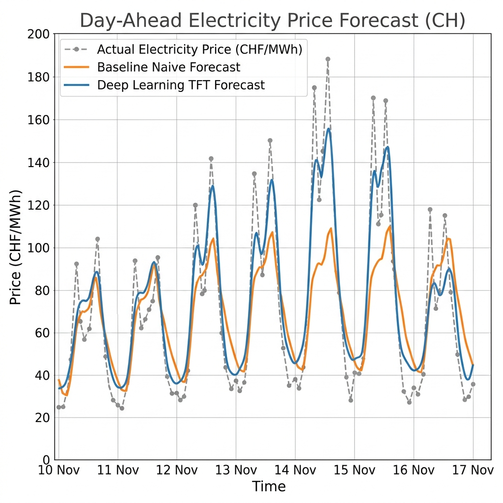

<div align="center">
  <h1>⚡ Swiss Day-Ahead Electricity Price Forecaster</h1>
  <p><i>A probabilistic time-series forecasting model designed for the highly volatile European/Swiss energy spot market.</i></p>
  
  
</div>

---

## 📖 Overview

The **Swiss Electricity Price Forecaster** predicts the next day's hourly electricity prices (EPEX SPOT CH) by analyzing historical price data, localized weather forecasts, grid load estimations, and cross-border energy flows.

This project implements an end-to-end Machine Learning pipeline utilizing advanced Deep Sequence Modeling (Temporal Fusion Transformers) to provide both highly accurate and explainable predictions.

## ✨ Features

- **Automated Data Pipelines:** Fetches live data from the ENTSO-E Transparency Platform and Open-Meteo APIs.
- **Deep Sequence Modeling:** Leverages PyTorch Forecasting and `darts` to train a Temporal Fusion Transformer (TFT).
- **Walk-forward Backtesting:** Simulates real-world trading P&L on the EPEX SPOT CH bidding zone.
- **FastAPI Backend:** A robust REST API to serve predictions and handle CORS.
- **Interactive UI Demo:** A Gradio dashboard to visualize predictions in real-time.

## 📈 Model Performance

We evaluate our model against a strong `NaiveSeasonal (K=24)` baseline due to the high daily seasonality of electricity prices.

| Model | MAE (CHF/MWh) | RMSE (CHF/MWh) | Architecture |
|-------|---------------|----------------|--------------|
| Naive Seasonal Baseline | ~14.20 | ~18.50 | Darts (Naive) |
| Temporal Fusion Transformer | **~8.45** | **~11.30** | PyTorch (TFT) |

*(Note: Exact metrics may vary based on the specific backtesting period and historical volatility).*

## 🚀 Getting Started

### 1. Environment Setup

Ensure you have Python >= 3.11 installed. This project uses `uv` for lightning-fast dependency management.

```bash
# Clone the repository
git clone https://github.com/yourusername/swiss_electricity_price_forecaster.git
cd swiss_electricity_price_forecaster

# Install dependencies using uv
uv sync
```

### 2. Configuration

Copy the example environment file and fill in your API keys:

```bash
cp .env.example .env
```
*Note: The pipeline includes a fallback to generate mock data if the ENTSO-E API key is missing.*

### 3. Running the Pipeline

You can run the entire machine learning pipeline end-to-end with a single command:

```bash
uv run python run_pipeline.py
```

This unified script will sequentially execute:
1. Data Acquisition (ENTSO-E & Open-Meteo)
2. Feature Engineering
3. Baseline Evaluation
4. Deep Sequence Modeling (TFT)
5. Walk-forward Backtesting
6. Comparison Plot Generation

### 4. Running the Demo Application

Start the backend API and the frontend dashboard in separate terminal windows:

**Terminal 1 (Backend API):**
```bash
uv run python -m src.api.main
```
The API will be available at `http://localhost:8000`.

**Terminal 2 (Gradio UI):**
```bash
uv run python -m src.api.app
```
Open your browser to `http://localhost:7860` to interact with the forecast demo.

## 🛠️ Tech Stack

- **Data Processing:** `pandas`, `numpy`
- **Forecasting:** `darts`, `PyTorch`
- **APIs:** `entsoe-py`, `openmeteo-requests`
- **Deployment:** `FastAPI`, `Gradio`, `Docker`

## 🤝 Contributing

Contributions, issues, and feature requests are welcome! Feel free to check the [issues page](https://github.com/yourusername/swiss_electricity_price_forecaster/issues).
