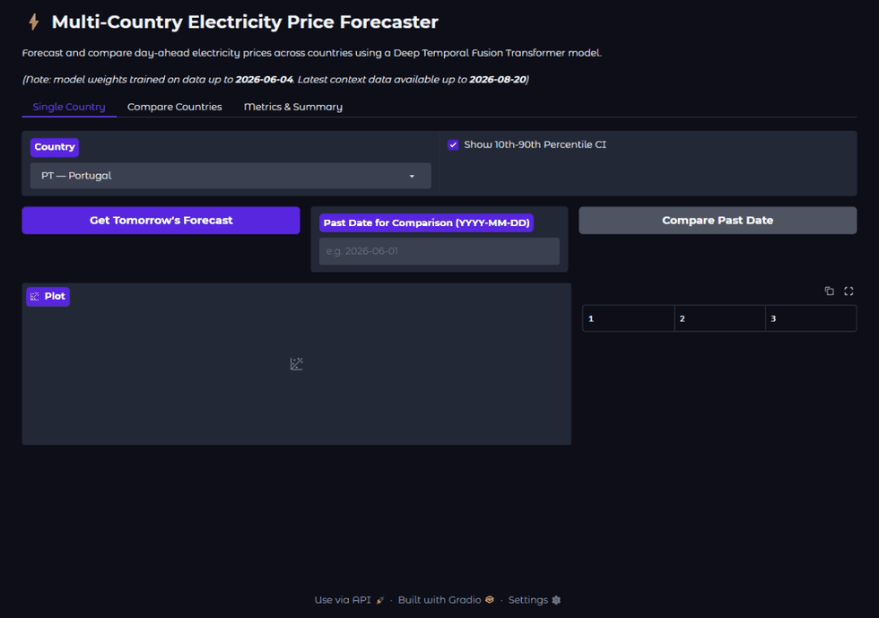

<div align="center">
  <h1>⚡ EU Electricity Price Forecaster</h1>
  <p><i>A probabilistic day-ahead electricity price forecasting stack — Portugal, Spain and Switzerland, trained and served end-to-end per country.</i></p>
  <p>
    <a href="https://github.com/pmasousa/EU-Electricity-Price-Forecaster/actions/workflows/ci.yml">
      
    </a>
  </p>
  <p></p>
</div>

---

## 📖 Overview

The **Electricity Price Forecaster** predicts the next day's hourly electricity prices for one or more countries by analyzing historical price data, localized weather, and grid load. It implements an end-to-end ML pipeline using a **Temporal Fusion Transformer (TFT)** for probabilistic, uncertainty-aware forecasts, and can **compare forecasts across countries** side by side.

Supported out of the box (config-driven — add more in `src/config.py`):

| Code | Country      | Bidding zone | Weather station |
|------|--------------|--------------|-----------------|
| PT   | Portugal     | PT           | Lisbon          |
| ES   | Spain        | ES           | Madrid          |
| CH   | Switzerland  | CH           | Zurich          |

**Status:** all three countries are trained, benchmarked, and served end-to-end; adding a fourth is a config entry plus one pipeline run.

## ✨ Features

- **Multi-country:** Train and serve a separate model per country; compare them in one view.
- **Config-driven countries:** Add a bidding zone by adding one entry to `src/config.py`.
- **Automated data pipelines:** Fetches live data from the **Energy-Charts API** (EPEX SPOT / ENTSO-E transparency aggregator) and **Open-Meteo**. **No API keys required.**
- **Deep sequence modeling:** Temporal Fusion Transformer via `darts` + PyTorch, with quantile outputs (10/50/90).
- **Walk-forward backtesting:** One shared harness (`src/evaluation/backtest.py`) scores every model — naive persistence, Linear Regression, LightGBM, TFT — on identical splits, covariates, and a day-ahead protocol, with MAE/RMSE/rMAE plus pinball loss and coverage for the quantile bands.
- **FastAPI backend:** REST endpoints for single-country forecasts, cross-country comparison, per-country metrics, and price summaries.
- **Interactive dashboard (Streamlit + Plotly):** forecasts auto-load on open; country + model selection (TFT bands, Linear Regression, LightGBM); hover/zoom charts with click-to-toggle legend; dark mode; three-country comparison and the walk-forward benchmark table.

## 📊 Benchmark — day-ahead walk-forward

Generated by `src/evaluation/backtest.py` (every run archived with its model and data snapshot under `reports/runs/`; latest tables in `reports/latest/`).

**Protocol:** ~3 years of hourly data per country (Energy-Charts + Open-Meteo) · train / 3-week early-stop val / 8-week holdout · day-ahead walk-forward (24h horizon, daily stride, frozen models) · MAE/RMSE in EUR/MWh across **all 24 forecast hours** · rMAE = MAE relative to yesterday's-curve persistence. Covariates: calendar + weather (realized-as-forecast proxy) + load lagged 24h/168h — realized load at forecast time is excluded (not knowable at gate closure).

### PT (26,184h, 2023-08 → 2026-08)

| Model | MAE | RMSE | rMAE |
|---|---|---|---|
| **Linear Regression** | **18.00** | **24.13** | **0.90** |
| LightGBM | 19.49 | 27.47 | 0.97 |
| Naive persistence (t-24) | 20.11 | 32.02 | 1.00 |
| Naive weekly (t-168) | 24.88 | 35.04 | 1.24 |
| TFT (minmax, 17q) | 25.45 | 31.70 | 1.27 |

Pinball @ q10/50/90: quantile-LightGBM **9.20** (breaches 10.8% / 50.7%) · TFT 9.64 (14.8% / 52.5%).

### ES (26,184h, 2023-08 → 2026-08)

| Model | MAE | RMSE | rMAE |
|---|---|---|---|
| **Linear Regression** | **17.36** | **23.23** | **0.88** |
| Naive persistence (t-24) | 19.70 | 30.77 | 1.00 |
| LightGBM | 20.05 | 28.44 | 1.02 |
| Naive weekly (t-168) | 25.06 | 35.00 | 1.27 |
| TFT (minmax, 17q) | 27.73 | 35.22 | 1.41 |

Pinball @ q10/50/90: quantile-LightGBM **8.72** (breaches 14.7% / 43.5%) · TFT 10.18 (13.5% / 49.9%).

### CH (26,016h, 2023-09 → 2026-08)

| Model | MAE | RMSE | rMAE |
|---|---|---|---|
| **LightGBM** | **16.69** | **23.29** | **0.78** |
| Linear Regression | 16.83 | 23.55 | 0.79 |
| Naive persistence (t-24) | 21.34 | 33.41 | 1.00 |
| Naive weekly (t-168) | 26.04 | 36.17 | 1.22 |
| TFT (minmax, 17q) | 24.21 | 32.07 | 1.13 |
| TFT (minmax, longer leash) | 23.00 | 31.30 | 1.08 |
| TFT (asinh, 5q) | 28.19 | 35.04 | 1.32 |

Pinball @ q10/50/90: TFT **6.49** (breaches 6.9% / 31.7%) · quantile-LightGBM 6.96 (17.4% / 36.6%).

**Notes:** Linear Regression wins the point forecast on both Iberian markets (rMAE 0.90 PT / 0.88 ES — LightGBM even trails persistence on ES); on CH, LightGBM and Linear Regression tie at rMAE 0.78. The TFT takes pinball on CH and trails quantile-LightGBM on PT/ES. q90 upside breaches run far past the 10% target in all three markets (PT/ES > 40%, against holdouts where prices roughly tripled their 3-year mean) — the driver for the v1.1 roadmap (neighboring-zone prices, day-ahead load forecasts). Served models are the benchmarked TFTs as-is (`build_serving.py`, no post-selection retrain). The pre-2026-08-25 metrics files used incompatible protocols (per-model splits, single-hour scoring, realized-load leakage) and were removed.

## 🔌 Data sources

- **Day-ahead prices & actual load** — [Energy-Charts API](https://api.energy-charts.info) (`/price?bzn=<ZONE>` and `/public_power?country=<cc>`). This aggregates EPEX SPOT / ENTSO-E Transparency Platform data. **No API key.**
- **Weather** — [Open-Meteo Archive API](https://archive-api.open-meteo.com/v1/archive). **No API key.**

> **Note on resolution.** Some bidding zones (e.g. ES, PT) publish day-ahead prices at 15-minute resolution, while others (e.g. CH) are hourly. The download layer resamples all series to a common **hourly** grid so features stay aligned. All prices are in **EUR/MWh** for every zone (Energy-Charts reports CH in EUR/MWh too).

## 🚀 Getting Started

### 1. Environment setup

Ensure you have Python >= 3.11 installed.

> [!WARNING]
> If you use an RTX 50-series GPU requiring PyTorch Nightly (CUDA 12.4+), `uv` may struggle to resolve it — use standard `pip` as shown below.

```bash
# Clone the repository
git clone https://github.com/pmasousa/EU-Electricity-Price-Forecaster.git
cd EU-Electricity-Price-Forecaster

# Create and activate a virtual environment
python -m venv .venv
# On Windows:
.venv\Scripts\activate
# On Linux/macOS: source .venv/bin/activate

# Install dependencies
pip install .

# (RTX 50-series only) PyTorch Nightly for CUDA 12.4:
pip install --pre torch torchvision torchaudio --extra-index-url https://download.pytorch.org/whl/nightly/cu124 --force-reinstall
```

### 2. Configuration

Countries live in `src/config.py`. To add a new country, append one entry:

```python
COUNTRIES = {
    ...
    "FR": {"name": "France", "bzn": "FR", "country": "fr",
           "lat": 48.8566, "lon": 2.3522, "tz": "Europe/Paris"},
}
```

The bidding-zone code (`bzn`) and country code (`country`) must match values accepted by the Energy-Charts API. Run a quick check before trusting a new zone:

```bash
curl "https://api.energy-charts.info/price?bzn=FR&start=2026-07-01&end=2026-07-02"
```

### 3. Running the pipeline

Run the full multi-country pipeline (downloads ~3 years of data, builds features, then trains and benchmark-scores every model through the shared harness):

```bash
# All countries in src/config.py
python run_pipeline.py

# Or a subset
python run_pipeline.py --countries CH

# Resume from a specific stage
python run_pipeline.py --start-from src/evaluation/backtest.py --countries CH
```

The pipeline runs, **per country**: data download → feature engineering → shared walk-forward benchmark (naive + Linear Regression + LightGBM + TFT). Artifacts are namespaced by country:

- Data: `data/raw/entsoe_prices_{CC}.csv`, `entsoe_load_{CC}.csv`, `weather_{CC}.csv`
- Features: `data/processed/features_{CC}.csv`
- Models: `models/tft_model_{CC}_{variant}.pt` (+ companion `.ckpt` weights), one per variant
- Serving bundle: `models/serving_{CC}/` — model + scalers + config, assembled by `src/models/build_serving.py` from the benchmarked artifacts; this is the directory the API loads
- Benchmark: `reports/runs/{CC}_{variant}/{timestamp}/` — every run's table, forecasts, plot, loss curve, model, and data snapshot; `reports/latest/` holds the newest table per variant

### 4. Running the demo

> Models (`models/`) and datasets (`data/`) are gitignored — run the pipeline (Step 3) first.

#### Option A: Local

```bash
# Terminal 1 — backend API (http://localhost:8000)
python -m src.api.main

# Terminal 2 — dashboard (http://localhost:8501)
streamlit run src/api/dashboard.py
```

#### Option B: Docker Compose

Services are split into profiles: `train` (one-shot, GPU) and `serve` (long-running API + dashboard).

```bash
# One-shot training run (GPU passthrough; downloads data, benchmark, serving bundles):
docker compose run --rm train

# Serve API (:8000) + dashboard (:8501):
docker compose --profile serve up api ui
```

Artifacts (`data/`, `models/`, `reports/`) are bind-mounted, so anything `train` produces is visible on the host and to the serving containers. The dashboard reads the backend from `API_URL` (defaults to `http://127.0.0.1:8000`; `http://api:8000` under Docker).

## 🌐 API reference

All prices are in **EUR/MWh**. The API loads every country model that has artifacts at startup and skips the rest.

| Endpoint | Description |
|----------|-------------|
| `GET /` | Health check; lists loaded and available countries. |
| `GET /predict?country=PT&model=tft&target_date=YYYY-MM-DD` | 24h forecast for one country. `model`: `tft` (default; q10/50/90 bands), `lr`, `lgbm` (point forecasts). `target_date` optional (retroactive). |
| `GET /compare?countries=PT,ES,CH&model=tft` | Forecasts for multiple countries in one payload, for overlay plots. Accepts `model` like `/predict`; countries without a loaded model are reported in `skipped`. |
| `GET /metrics` | Per-country benchmark metrics (MAE/RMSE/rMAE) parsed from `reports/latest/benchmark_*.txt`, with the served model flagged. |
| `GET /summary?countries=PT,ES,CH` | Price-level summary per country: mean/median/min/max forecast price and peak hour. |

Response field names (note the EUR currency):

```jsonc
{
  "country": "PT", "country_name": "Portugal",
  "forecast": [
    { "timestamp": "...", "predicted_price_eur_mwh": 62.4, "q10": 50.1, "q90": 74.8,
      "actual_price_eur_mwh": 61.0 }   // actual only present for retroactive queries
  ]
}
```

## 🛠️ Tech stack

- **Data processing:** `pandas`, `numpy`
- **Forecasting:** `darts`, `PyTorch` (Temporal Fusion Transformer, `QuantileRegression`)
- **Weather:** `openmeteo-requests`
- **Serving:** `FastAPI`, `Streamlit`, `Plotly`, `Docker`

## Architecture & implementation notes

- **Per-country models.** Each country gets its own TFT, scalers, and feature table, isolated by a country suffix. This keeps performance per market independent and makes adding a country a config-only change at the data layer.
- **Multi-horizon forecasting.** The TFT processes a 168-hour (7-day) lookback and directly outputs the 24-hour day-ahead curve in one shot, avoiding auto-regressive error compounding.
- **Probabilistic forecasting.** Configured with `QuantileRegression`, the model outputs a distribution (10/50/90 percentiles) to quantify uncertainty — important in spike-prone markets.
- **Hourly normalization + honest covariates.** Download resamples any resolution to hourly so per-country features stay aligned (17 covariates: weather, calendar, cyclic encodings, and load lagged 24h/168h — realized load at forecast time is excluded, it is not knowable at day-ahead gate closure).
- **Strict covariate separation.** `future_covariates` (weather, calendar) are separated from the target, and scalers are fitted only on the training split to prevent leakage during walk-forward backtesting.
- **Hardware-agnostic inference.** `trainer_params` are overridden to `accelerator='cpu'` at load time, so GPU-trained models serve on CPU.
- **Secure deserialization.** `QuantileRegression` and `GlobalTimerCallback` are registered via `torch.serialization.add_safe_globals` for safe unpickling (PyTorch 2.6+ `weights_only` default).

> **Known environment caveat (torch nightly vs darts 0.45).** Checkpoints saved under *different* darts/PyTorch-Lightning versions may fail to deserialize on the installed stack — that's version drift, not a project bug. Serving bundles are built from models trained by this repo's harness under the installed versions; if you swap library versions, retrain and rebuild (`run_pipeline.py` + `src/models/build_serving.py`).
